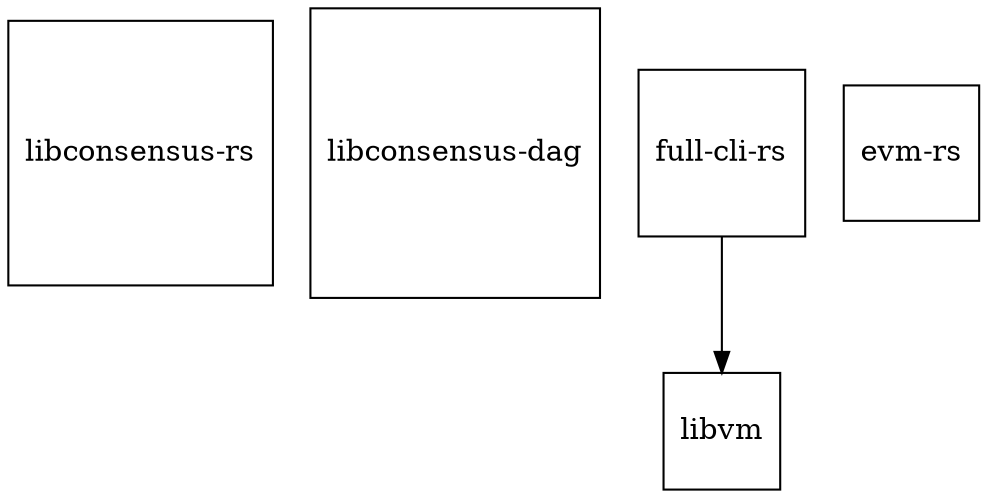

## Configuration
This document defines how `full-cli-rs` configures consensus and VM.

### `Cargo.toml` dependencies

```dot
digraph {
  libconsensus[label="libconsensus-rs",shape="square"];
  dagconsensus[label="libconsensus-dag",shape="square"];
  libvm[shape="square"];
  evm[label="evm-rs",shape="square"];
  full[label="full-cli-rs",shape="square"];

  full->libvm;
}
```
